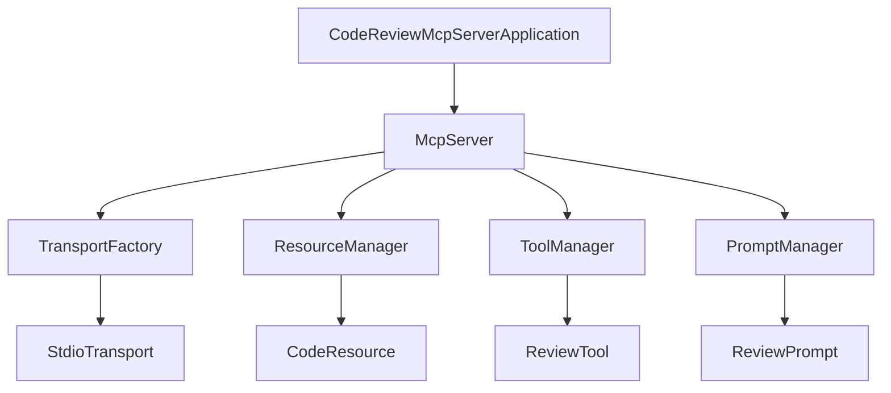

# Story 1: Configuração Inicial do Servidor MCP

## Story

**As a** desenvolvedor
**I want** configurar a estrutura básica do servidor MCP em Java com Spring Boot
**so that** eu possa começar a implementar as funcionalidades de revisão de código

## Status

Draft

## Context

O CodeReview MCP Server é um servidor baseado no protocolo Model Context Protocol (MCP) que fornece capacidades de revisão de código automatizada para modelos de linguagem. Conforme definido no PRD, o servidor deve ser implementado em Java com Spring Boot e o SDK Java MCP, suportando inicialmente o transporte stdio para integração com clientes como o Cursor e o Claude Desktop.

Esta história inicial abrange a configuração do projeto, incluindo a estrutura básica do servidor MCP, dependências necessárias e configuração do transporte stdio. Esta é a base sobre a qual todas as outras funcionalidades serão construídas.

## Estimation

Story Points: 3

## Tasks

1. - [ ] Configurar projeto Spring Boot
   1. - [ ] Criar projeto usando Spring Initializr com Java 21
   2. - [ ] Adicionar dependências do MCP Java SDK
   3. - [ ] Configurar estrutura de pacotes

2. - [ ] Implementar servidor MCP básico
   1. - [ ] Criar classe principal do servidor
   2. - [ ] Configurar handlers MCP básicos
   3. - [ ] Implementar inicialização do servidor

3. - [ ] Configurar transporte stdio
   1. - [ ] Implementar adaptador de transporte stdio
   2. - [ ] Configurar conexão com clientes
   3. - [ ] Testar comunicação básica

4. - [ ] Implementar estrutura para gerenciamento de recursos
   1. - [ ] Criar interfaces para recursos de código
   2. - [ ] Implementar gerenciador de recursos básico

5. - [ ] Implementar estrutura para gerenciamento de ferramentas
   1. - [ ] Criar interfaces para ferramentas de revisão
   2. - [ ] Implementar gerenciador de ferramentas básico

6. - [ ] Implementar estrutura para gerenciamento de prompts
   1. - [ ] Criar interfaces para prompts de revisão
   2. - [ ] Implementar gerenciador de prompts básico

7. - [ ] Testes
   1. - [ ] Escrever testes unitários para componentes básicos
   2. - [ ] Escrever testes de integração para verificar comunicação MCP

## Constraints

- Deve ser compatível com MCP versão 2024-11-05 ou superior
- Deve suportar Java 21 ou superior
- Deve seguir as melhores práticas de desenvolvimento Spring Boot
- Deve implementar logging adequado para facilitar depuração

## Data Models / Schema

```java
// Modelo básico para configuração do servidor
public class McpServerConfig {
    private String serverName;
    private String serverVersion;
    private TransportType transportType;
    private Map<String, Object> additionalConfig;
    
    // getters e setters
}

// Enum para tipos de transporte
public enum TransportType {
    STDIO,
    SSE
}
```

## Structure

```code
com.codereview.mcp
├── CodeReviewMcpServerApplication.java
├── config
│   ├── McpConfig.java
│   └── TransportConfig.java
├── core
│   ├── McpServer.java
│   ├── resource
│   │   ├── ResourceManager.java
│   │   └── CodeResource.java
│   ├── tool
│   │   ├── ToolManager.java
│   │   └── ReviewTool.java
│   └── prompt
│       ├── PromptManager.java
│       └── ReviewPrompt.java
├── transport
│   ├── TransportFactory.java
│   └── stdio
│       └── StdioTransport.java
└── util
    └── LoggingUtil.java
```

## Diagrams



## Dev Notes

- Iniciar com uma implementação minimalista que possa ser expandida nas próximas histórias
- Focar na estrutura correta e interfaces bem definidas para facilitar a implementação futura
- Garantir que a comunicação básica via stdio funcione corretamente antes de avançar

## Chat Command Log

- 