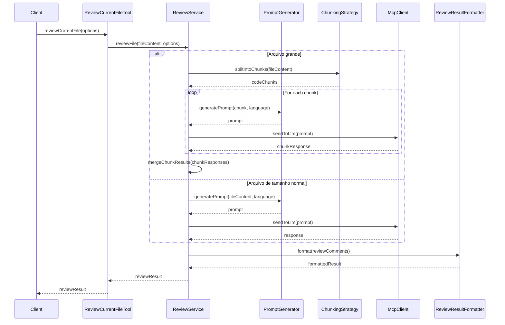

# Story 2: Implementação da Ferramenta de Revisão de Arquivo Único

## Story

**As a** desenvolvedor
**I want** implementar a ferramenta MCP para revisar um arquivo de código único
**so that** os usuários possam obter feedback sobre a qualidade, segurança e manutenibilidade de seus arquivos

## Status

Draft

## Context

Após a configuração inicial do servidor MCP na Story 1, precisamos implementar a primeira ferramenta de revisão de código. A ferramenta `reviewCurrentFile` permitirá aos usuários revisar o arquivo atualmente aberto no editor, fornecendo feedback sobre problemas de qualidade, segurança, legibilidade e manutenibilidade.

Esta ferramenta é fundamental para o MVP do produto, pois representa o caso de uso mais básico e comum: revisar um único arquivo de código. A implementação utilizará a integração com o LLM já fornecido pelo Cursor através da janela de chat, eliminando a necessidade de implementar nossa própria integração com modelos LLM específicos e aproveitando a flexibilidade de trabalhar com qualquer modelo suportado pelo editor.

## Estimation

Story Points: 4

## Tasks

1. - [ ] Implementar a ferramenta `reviewCurrentFile`
   1. - [ ] Definir a interface da ferramenta com parâmetros e retorno
   2. - [ ] Implementar a anotação `@McpTool` com metadados apropriados
   3. - [ ] Implementar a lógica para obter o conteúdo do arquivo atual

2. - [ ] Implementar geração de prompts para revisão
   1. - [ ] Criar templates de prompts para diferentes linguagens
   2. - [ ] Implementar lógica para detectar a linguagem do arquivo
   3. - [ ] Implementar mecanismo para combinar template com código
   4. - [ ] Implementar lógica para lidar com arquivos grandes (chunking)

3. - [ ] Implementar processamento de resultados
   1. - [ ] Criar modelo para resultados da revisão
   2. - [ ] Implementar parser para extrair comentários da resposta do LLM
   3. - [ ] Implementar validação e correção de resultados
   4. - [ ] Implementar classificação e filtragem por severidade

4. - [ ] Implementar formatação de saída
   1. - [ ] Criar formatador para resultados da revisão
   2. - [ ] Implementar geração de links para linhas específicas
   3. - [ ] Implementar agrupamento por categoria

5. - [ ] Implementar suporte a linguagens prioritárias
   1. - [ ] Implementar suporte a Java
   2. - [ ] Implementar suporte a JavaScript/TypeScript
   3. - [ ] Implementar suporte a Python

6. - [ ] Testes
   1. - [ ] Escrever testes unitários para a ferramenta
   2. - [ ] Testar com diferentes tipos de arquivos e linguagens
   3. - [ ] Testar estratégias de chunking para arquivos grandes

## Constraints

- Deve funcionar com arquivos de tamanho razoável (até 8.000 linhas)
- Para arquivos maiores, deve implementar estratégia de chunking ou análise parcial
- Tempo de resposta depende do modelo LLM usado pelo Cursor
- Deve suportar as linguagens prioritárias definidas no PRD
- Deve classificar problemas de acordo com a escala de severidade (1-5)
- Deve categorizar problemas conforme definido no PRD

## Data Models / Schema

```java
// Opções para revisão de código
public class ReviewOptions {
    private Integer minSeverity = 2;
    private List<String> categories;
    private String customPrompt;
    private Boolean debug;
    
    // getters e setters
}

// Resultado da revisão
public class ReviewResult {
    private String fileName;
    private List<ReviewComment> comments;
    private Map<Integer, Integer> severityCounts; // Mapa de severidade -> contagem
    private long processingTimeMs;
    
    // getters e setters
}

// Comentário de revisão
public class ReviewComment {
    private String file;
    private int line;
    private String comment;
    private int severity;
    private String category;
    
    // getters e setters
}

// Estratégia para lidar com arquivos grandes
public class ChunkingStrategy {
    private int maxLinesPerChunk;
    private int overlapLines;
    private boolean analyzeImportantSectionsOnly; // métodos, classes, etc.
    
    // getters e setters
}
```

## Structure

```
com.codereview.mcp
├── ...
├── review
│   ├── ReviewService.java
│   ├── tool
│   │   └── ReviewCurrentFileTool.java
│   ├── prompt
│   │   ├── PromptGenerator.java
│   │   ├── LanguageDetector.java
│   │   └── ChunkingStrategy.java
│   ├── model
│   │   ├── ReviewOptions.java
│   │   ├── ReviewResult.java
│   │   └── ReviewComment.java
│   └── formatter
│       └── ReviewResultFormatter.java
└── ...
```

## Diagrams



## Dev Notes

- Aproveitar a integração com LLM já fornecida pelo Cursor, eliminando a necessidade de implementar nossa própria integração
- Implementar estratégia eficiente para lidar com arquivos grandes (chunking, análise seletiva)
- Considerar a possibilidade de analisar apenas seções importantes em arquivos grandes (métodos, classes)
- Garantir que os comentários sejam acionáveis e específicos
- A ferramenta deve ser compatível com outros editores que suportam MCP e LLMs, como VSCode com Github Copilot ou IntelliJ

## Chat Command Log

- 