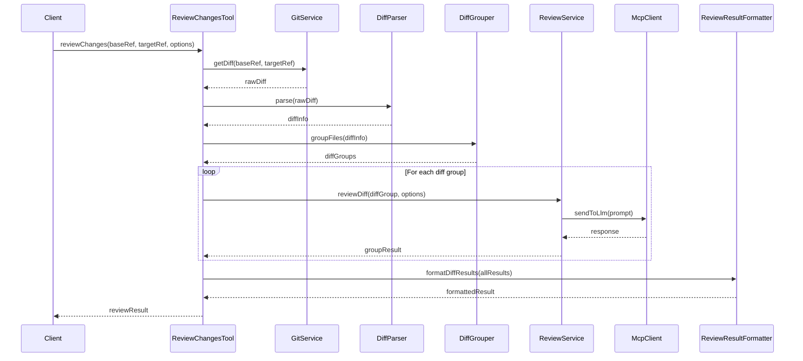

# Story 3: Implementação da Ferramenta de Revisão de Diferenças entre Commits

## Story

**As a** desenvolvedor
**I want** implementar a ferramenta MCP para revisar diferenças entre commits ou branches
**so that** eu possa obter feedback sobre as mudanças específicas antes de fazer merge ou deploy

## Status

Draft

## Context

Após implementar a ferramenta de revisão de arquivo único na Story 2, precisamos expandir as capacidades do servidor MCP para permitir a revisão de diferenças entre commits ou branches. Esta funcionalidade é essencial para fluxos de trabalho de desenvolvimento, permitindo que os desenvolvedores obtenham feedback sobre suas mudanças específicas antes de integrá-las ao código principal.

A ferramenta `reviewChanges` analisará as diferenças (diffs) entre dois pontos de referência no histórico do Git, como commits ou branches, e fornecerá comentários apenas sobre as linhas que foram adicionadas ou modificadas. Isso permite uma revisão mais focada e relevante para o contexto atual do desenvolvimento. Assim como na Story 2, utilizaremos a integração com o LLM já fornecido pelo Cursor, aproveitando a flexibilidade de trabalhar com qualquer modelo suportado pelo editor.

## Estimation

Story Points: 6

## Tasks

1. - [ ] Implementar integração com Git
   1. - [ ] Adicionar dependência JGit ao projeto
   2. - [ ] Criar serviço para interação com repositórios Git
   3. - [ ] Implementar métodos para obter diferenças entre commits/branches

2. - [ ] Implementar parser de diff
   1. - [ ] Criar modelo para representar diferenças de código
   2. - [ ] Implementar parser para extrair informações relevantes do diff
   3. - [ ] Implementar lógica para identificar linhas adicionadas/modificadas

3. - [ ] Implementar a ferramenta `reviewChanges`
   1. - [ ] Definir a interface da ferramenta com parâmetros e retorno
   2. - [ ] Implementar a anotação `@McpTool` com metadados apropriados
   3. - [ ] Implementar lógica para obter e processar diferenças

4. - [ ] Implementar agrupamento de arquivos
   1. - [ ] Criar lógica para agrupar arquivos em requests
   2. - [ ] Implementar mecanismo para limitar tamanho dos grupos
   3. - [ ] Implementar processamento sequencial de grupos

5. - [ ] Adaptar geração de prompts para diffs
   1. - [ ] Criar templates de prompts específicos para revisão de diffs
   2. - [ ] Implementar lógica para formatar diffs no prompt
   3. - [ ] Adicionar instruções específicas para focar apenas em linhas adicionadas/modificadas

6. - [ ] Implementar processamento de resultados para diffs
   1. - [ ] Adaptar parser para mapear comentários às linhas corretas no diff
   2. - [ ] Implementar validação específica para comentários em diffs
   3. - [ ] Implementar filtragem para remover comentários em linhas não modificadas

7. - [ ] Implementar formatação de saída para diffs
   1. - [ ] Adaptar formatador para resultados de diff
   2. - [ ] Implementar agrupamento por arquivo e commit
   3. - [ ] Implementar geração de links para linhas específicas no contexto do diff

8. - [ ] Testes
   1. - [ ] Escrever testes unitários para a ferramenta
   2. - [ ] Escrever testes de integração com Git
   3. - [ ] Testar com diferentes tipos de diffs e cenários

## Constraints

- Deve funcionar com diffs de até 20 arquivos ou 5.000 linhas modificadas
- Tempo de resposta depende do modelo LLM usado pelo Cursor
- Deve suportar repositórios Git locais
- Deve focar apenas em linhas adicionadas ou modificadas, ignorando linhas removidas
- Deve manter o contexto das mudanças para análise adequada

## Data Models / Schema

```java
// Modelo para representar diferenças
public class DiffInfo {
    private String baseRef;
    private String targetRef;
    private List<FileDiff> fileDiffs;
    private int totalAddedLines;
    private int totalRemovedLines;
    
    // getters e setters
}

// Modelo para diferenças em um arquivo
public class FileDiff {
    private String filePath;
    private DiffType diffType; // ADDED, MODIFIED, DELETED
    private List<LineDiff> lineDiffs;
    private String fileType; // Extensão ou tipo do arquivo
    
    // getters e setters
}

// Modelo para diferença em uma linha
public class LineDiff {
    private int oldLineNumber; // 0 para linhas adicionadas
    private int newLineNumber; // 0 para linhas removidas
    private DiffLineType type; // ADDED, REMOVED, CONTEXT
    private String content;
    
    // getters e setters
}

// Enum para tipos de diferença de linha
public enum DiffLineType {
    ADDED,
    REMOVED,
    CONTEXT
}

// Enum para tipos de diferença de arquivo
public enum DiffType {
    ADDED,
    MODIFIED,
    DELETED
}
```

## Structure

```code
com.codereview.mcp
├── ...
├── git
│   ├── GitService.java
│   ├── DiffParser.java
│   └── model
│       ├── DiffInfo.java
│       ├── FileDiff.java
│       ├── LineDiff.java
│       ├── DiffLineType.java
│       └── DiffType.java
├── review
│   ├── ...
│   ├── tool
│   │   ├── ...
│   │   └── ReviewChangesTool.java
│   ├── diff
│   │   ├── DiffReviewService.java
│   │   └── DiffGrouper.java
│   └── ...
└── ...
```

## Diagrams



## Dev Notes

- A integração com Git deve ser modular para permitir diferentes implementações (JGit, comandos nativos, etc.)
- O agrupamento de arquivos é crucial para performance e deve ser configurável
- Aproveitar a integração com LLM já fornecida pelo Cursor, eliminando a necessidade de implementar nossa própria integração
- Garantir que o contexto das mudanças seja preservado para análise adequada
- A ferramenta deve ser compatível com outros editores que suportam MCP e LLMs

## Chat Command Log

-
