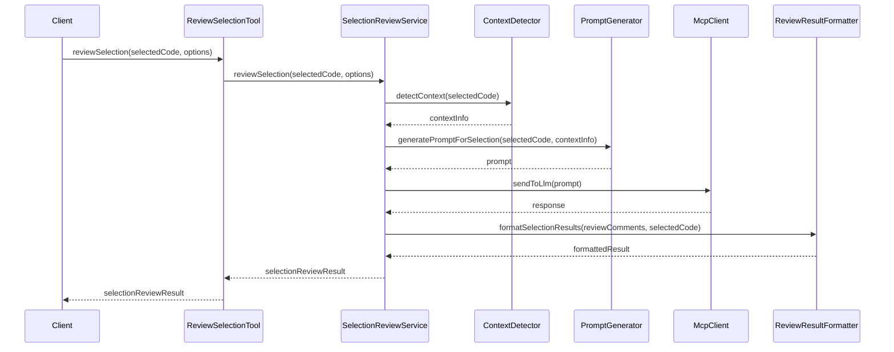

# Story 4: Implementação da Ferramenta de Revisão de Código Selecionado

## Story

**As a** desenvolvedor
**I want** implementar a ferramenta MCP para revisar apenas o código selecionado no editor
**so that** eu possa obter feedback rápido sobre trechos específicos de código sem precisar revisar o arquivo inteiro

## Status

Draft

## Context

Após implementar as ferramentas para revisar arquivos inteiros e diferenças entre commits nas Stories 2 e 3, precisamos oferecer uma opção mais granular para os desenvolvedores. A ferramenta `reviewSelection` permitirá aos usuários selecionar um trecho específico de código no editor e obter feedback apenas sobre essa seleção.

Esta funcionalidade é particularmente útil quando o desenvolvedor está trabalhando em um arquivo grande e deseja focar a revisão em uma função ou bloco específico que acabou de implementar ou modificar. Isso proporciona um feedback mais rápido e focado, melhorando a experiência do usuário e a eficiência do processo de desenvolvimento. Assim como nas stories anteriores, utilizaremos a integração com o LLM já fornecido pelo Cursor.

## Estimation

Story Points: 2

## Tasks

1. - [ ] Implementar a ferramenta `reviewSelection`
   1. - [ ] Definir a interface da ferramenta com parâmetros e retorno
   2. - [ ] Implementar a anotação `@McpTool` com metadados apropriados
   3. - [ ] Implementar lógica para processar o código selecionado

2. - [ ] Adaptar geração de prompts para seleções de código
   1. - [ ] Criar templates de prompts específicos para revisão de seleções
   2. - [ ] Implementar lógica para preservar o contexto da seleção
   3. - [ ] Adicionar instruções específicas para análise de trechos isolados

3. - [ ] Implementar processamento de resultados para seleções
   1. - [ ] Adaptar parser para mapear comentários às linhas corretas na seleção
   2. - [ ] Implementar ajuste de números de linha para corresponder ao arquivo original
   3. - [ ] Implementar validação específica para comentários em seleções

4. - [ ] Implementar formatação de saída para seleções
   1. - [ ] Adaptar formatador para resultados de seleção
   2. - [ ] Implementar geração de links para linhas específicas no contexto do arquivo original
   3. - [ ] Implementar indicadores visuais para delimitar a seleção nos resultados

5. - [ ] Implementar detecção de contexto
   1. - [ ] Criar lógica para detectar o tipo de bloco selecionado (função, classe, etc.)
   2. - [ ] Implementar extração de informações contextuais relevantes
   3. - [ ] Adaptar prompts com base no contexto detectado

6. - [ ] Testes
   1. - [ ] Escrever testes unitários para a ferramenta
   2. - [ ] Testar com diferentes tipos de seleções e linguagens
   3. - [ ] Testar casos de borda (seleções muito pequenas, incompletas, etc.)

## Constraints

- Deve funcionar com seleções de até 1.000 linhas
- Tempo de resposta depende do modelo LLM usado pelo Cursor
- Deve preservar o contexto da seleção para análise adequada
- Deve mapear corretamente os números de linha da seleção para o arquivo original
- Deve funcionar mesmo com seleções que não representam blocos sintáticos completos

## Data Models / Schema

```java
// Modelo para representar uma seleção de código
public class CodeSelection {
    private String filePath;
    private String fileContent; // Conteúdo completo do arquivo (opcional)
    private String selectedCode; // Apenas o código selecionado
    private int startLine; // Linha inicial da seleção no arquivo
    private int endLine; // Linha final da seleção no arquivo
    private String language; // Linguagem do código
    private Map<String, Object> contextInfo; // Informações contextuais adicionais
    
    // getters e setters
}

// Modelo para resultado da revisão de seleção
public class SelectionReviewResult extends ReviewResult {
    private int startLine;
    private int endLine;
    private String selectedCodePreview; // Prévia do código selecionado
    
    // getters e setters
}
```

## Structure

```
com.codereview.mcp
├── ...
├── review
│   ├── ...
│   ├── tool
│   │   ├── ...
│   │   └── ReviewSelectionTool.java
│   ├── selection
│   │   ├── SelectionReviewService.java
│   │   └── ContextDetector.java
│   ├── model
│   │   ├── ...
│   │   ├── CodeSelection.java
│   │   └── SelectionReviewResult.java
│   └── ...
└── ...
```

## Diagrams



## Dev Notes

- A detecção de contexto é importante para fornecer análises mais relevantes
- Considerar adicionar opção para incluir linhas de contexto antes e depois da seleção
- Para seleções muito pequenas, pode ser útil sugerir expandir a seleção para um bloco sintático completo
- Garantir que os números de linha nos resultados correspondam ao arquivo original, não apenas à seleção
- Aproveitar a integração com LLM já fornecida pelo Cursor, eliminando a necessidade de implementar nossa própria integração
- A ferramenta deve ser compatível com outros editores que suportam MCP e LLMs

## Chat Command Log

- 