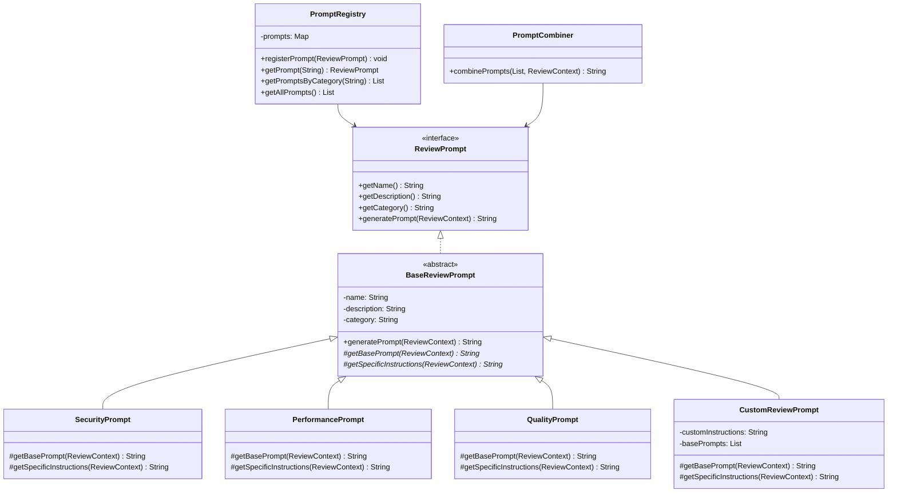
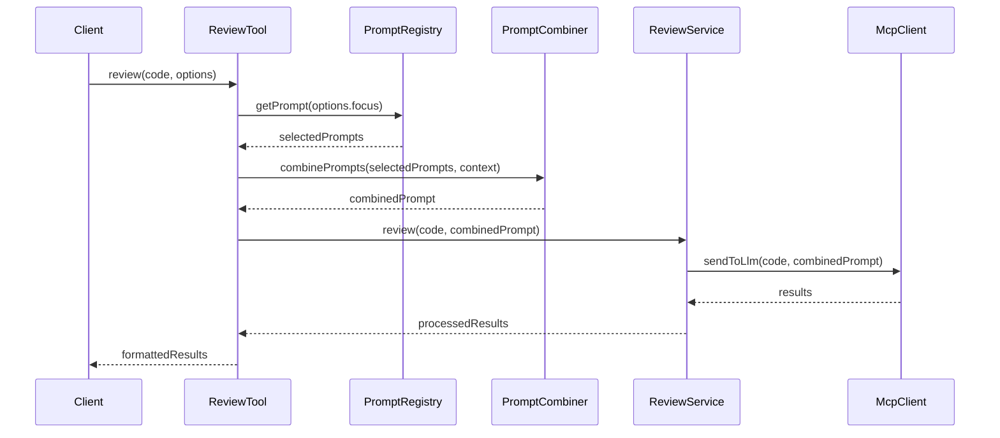

# Story 5: Implementação de Prompts Pré-definidos e Customizáveis

## Story

**As a** desenvolvedor
**I want** implementar prompts pré-definidos e customizáveis para diferentes tipos de revisão de código
**so that** os usuários possam focar a análise em aspectos específicos como segurança, performance ou qualidade

## Status

Draft

## Context

Após implementar as ferramentas básicas de revisão de código nas Stories 1-4, precisamos melhorar a flexibilidade e a especificidade das análises. Os prompts pré-definidos e customizáveis permitirão aos usuários direcionar o foco da revisão para aspectos específicos do código, como segurança, performance, qualidade ou manutenibilidade.

Esta funcionalidade é importante para obter análises mais relevantes e específicas, permitindo que os desenvolvedores obtenham feedback direcionado para suas necessidades atuais. Além disso, a capacidade de customizar prompts permitirá que equipes adaptem as revisões para seus padrões e requisitos específicos. Utilizaremos a integração com o LLM já fornecido pelo Cursor, garantindo compatibilidade com qualquer modelo suportado pelo editor.

## Estimation

Story Points: 3

## Tasks

1. - [ ] Implementar sistema de gerenciamento de prompts
   1. - [ ] Criar interface para definição de prompts
   2. - [ ] Implementar registro e descoberta de prompts
   3. - [ ] Implementar mecanismo de seleção de prompts

2. - [ ] Implementar prompts pré-definidos para segurança
   1. - [ ] Criar prompt para análise de vulnerabilidades OWASP Top 10
   2. - [ ] Criar prompt para análise de validação de entrada
   3. - [ ] Criar prompt para análise de gerenciamento de credenciais

3. - [ ] Implementar prompts pré-definidos para performance
   1. - [ ] Criar prompt para análise de eficiência de algoritmos
   2. - [ ] Criar prompt para análise de uso de recursos
   3. - [ ] Criar prompt para análise de otimização de consultas

4. - [ ] Implementar prompts pré-definidos para qualidade de código
   1. - [ ] Criar prompt para análise de princípios SOLID
   2. - [ ] Criar prompt para análise de code smells
   3. - [ ] Criar prompt para análise de convenções de codificação

5. - [ ] Implementar prompts pré-definidos para manutenibilidade
   1. - [ ] Criar prompt para análise de acoplamento e coesão
   2. - [ ] Criar prompt para análise de complexidade
   3. - [ ] Criar prompt para análise de documentação

6. - [ ] Implementar sistema de customização de prompts
   1. - [ ] Criar mecanismo para combinar prompts pré-definidos com texto customizado
   2. - [ ] Implementar persistência de prompts customizados
   3. - [ ] Implementar interface para gerenciamento de prompts customizados

7. - [ ] Integrar prompts com ferramentas de revisão
   1. - [ ] Adaptar ferramentas para aceitar seleção de prompts
   2. - [ ] Implementar parâmetro de foco para direcionar a análise
   3. - [ ] Implementar combinação de múltiplos focos

8. - [ ] Testes
   1. - [ ] Escrever testes unitários para o sistema de prompts
   2. - [ ] Testar eficácia dos prompts pré-definidos
   3. - [ ] Testar customização e combinação de prompts

## Constraints

- Os prompts devem ser específicos o suficiente para direcionar a análise, mas não tão restritivos que limitem a capacidade do LLM
- Deve ser possível combinar múltiplos focos em uma única análise
- Os prompts customizados devem ser persistidos entre sessões
- O sistema deve ser extensível para permitir a adição de novos prompts no futuro
- Tempo de resposta depende do modelo LLM usado pelo Cursor

## Data Models / Schema

```java
// Interface para definição de prompts
public interface ReviewPrompt {
    String getName();
    String getDescription();
    String getCategory();
    String generatePrompt(ReviewContext context);
}

// Implementação base para prompts
public abstract class BaseReviewPrompt implements ReviewPrompt {
    private final String name;
    private final String description;
    private final String category;
    
    // construtor, getters
    
    @Override
    public String generatePrompt(ReviewContext context) {
        // Implementação base que pode ser sobrescrita
        return getBasePrompt(context) + getSpecificInstructions(context);
    }
    
    protected abstract String getBasePrompt(ReviewContext context);
    protected abstract String getSpecificInstructions(ReviewContext context);
}

// Contexto para geração de prompts
public class ReviewContext {
    private String language;
    private String codeType; // arquivo, diff, seleção
    private Map<String, Object> additionalContext;
    
    // getters e setters
}

// Prompt customizado
public class CustomReviewPrompt extends BaseReviewPrompt {
    private String customInstructions;
    private List<ReviewPrompt> basePrompts;
    
    // implementação dos métodos abstratos
}
```

## Structure

```
com.codereview.mcp
├── ...
├── prompt
│   ├── ReviewPrompt.java
│   ├── BaseReviewPrompt.java
│   ├── ReviewContext.java
│   ├── CustomReviewPrompt.java
│   ├── PromptRegistry.java
│   ├── PromptCombiner.java
│   ├── security
│   │   ├── OWASPSecurityPrompt.java
│   │   ├── InputValidationPrompt.java
│   │   └── CredentialManagementPrompt.java
│   ├── performance
│   │   ├── AlgorithmEfficiencyPrompt.java
│   │   ├── ResourceUsagePrompt.java
│   │   └── QueryOptimizationPrompt.java
│   ├── quality
│   │   ├── SOLIDPrinciplesPrompt.java
│   │   ├── CodeSmellsPrompt.java
│   │   └── CodingConventionsPrompt.java
│   └── maintainability
│       ├── CouplingCohesionPrompt.java
│       ├── ComplexityPrompt.java
│       └── DocumentationPrompt.java
└── ...
```

## Diagrams





## Dev Notes

- Os prompts devem ser modulares para permitir combinação e reutilização
- Considerar o uso de templates com placeholders para partes variáveis dos prompts
- Testar diferentes formulações de prompts para encontrar as mais eficazes
- Documentar bem os prompts pré-definidos para facilitar o uso
- Aproveitar a integração com LLM já fornecida pelo Cursor, eliminando a necessidade de implementar nossa própria integração
- A ferramenta deve ser compatível com outros editores que suportam MCP e LLMs

## Chat Command Log

- 